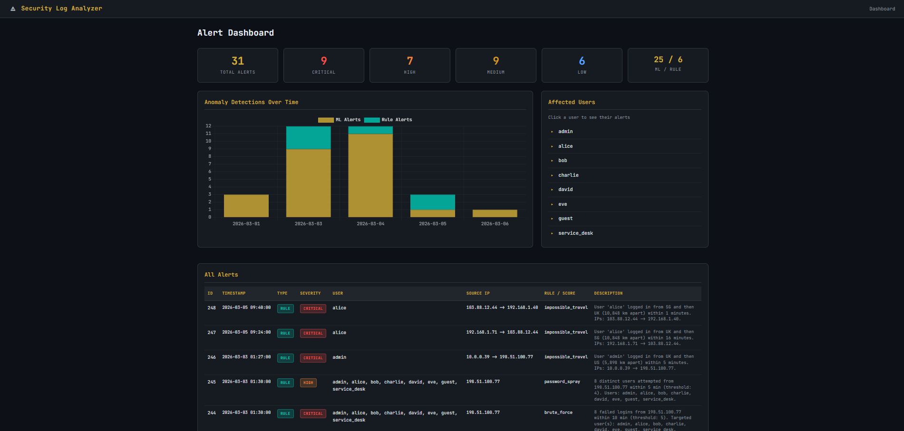

# AI Security Log Analyzer

Detecting dodgy authentication behaviour with ML-driven anomaly detection.



---

## Overview

This started as a project to teach myself how security analytics pipelines actually work — turns out there's a lot more to it than just throwing sklearn at some logs.

The system generates fake auth telemetry, processes login events, builds out behavioural features, and runs an **Isolation Forest** to flag suspicious logins. There's also a **rule engine** for the obvious stuff (brute force, password spraying, etc.) and a **Django dashboard** to visualise everything.

It covers detection of things like:

- Brute-force login attempts
- Password spraying
- Suspicious admin activity at odd hours
- Logins from new IPs or devices
- Impossible travel (same user, two countries, 40 minutes apart)

Basically a simplified version of what SOC teams and security engineers deal with, minus the 3am pager alerts.

---

## Architecture

Pretty standard data pipeline setup:

```
Authentication Logs
│
▼
Data Generation / Ingestion
│
▼
Preprocessing & Feature Engineering
│
▼
Isolation Forest  +  Rule Engine
│
▼
Anomaly Detection & Alerts
│
▼
SQLite / JSON Export
│
▼
Django Dashboard
```

---

## Project Structure

```
SecurityLogAnalyzer/
│
├── run_pipeline.py                    # CLI entry point — runs everything or individual stages
│
├── src/
│   ├── generate_sample_data.py        # Stage 1: Generate synthetic login data with attacks
│   ├── preprocess.py                  # Stage 2: Parse timestamps, extract time features
│   ├── feature_engineering.py         # Stage 3: Build behavioural features
│   ├── train_model.py                 # Stage 4: Train the Isolation Forest
│   ├── detect_anomalies.py            # Stage 5: Run detection and write reports
│   ├── alert_manager.py              # Stage 6: Merge ML + rule alerts into SQLite/JSON
│   ├── rule_engine.py                 # Threshold-based detection rules
│   ├── evaluate.py                    # Stage 7: Evaluate against ground-truth labels
│   └── visualize_anomalies.py         # Stage 8: Chart of anomalies by date
│
├── dashboard/
│   ├── manage.py
│   ├── dashboard_config/
│   │   ├── settings.py
│   │   ├── urls.py
│   │   └── wsgi.py
│   └── alerts/
│       ├── views.py                   # Dashboard views (home, user detail, chart API)
│       ├── urls.py
│       ├── templates/alerts/          # HTML templates
│       ├── static/css/style.css       # Dark theme
│       └── templatetags/alert_tags.py # Custom filters
│
├── data/
│   ├── raw/                           # Raw generated data
│   ├── processed/                     # Feature-engineered data
│   ├── alerts.db                      # SQLite database
│   └── alerts.json                    # JSON export
│
├── models/
│   └── isolation_forest.pkl           # Saved model
│
├── output/
│   ├── alerts.csv                     # Flagged anomalies
│   ├── anomaly_report.txt             # Human-readable report
│   ├── anomalies_by_date.png          # Bar chart
│   └── confusion_matrix.png           # Evaluation heatmap
│
├── notebooks/                         # Jupyter notebooks for poking around
├── requirements.txt
└── README.md
```

---

## Getting Started

### Prerequisites

- Python 3.10+
- pip

### Installation

```bash
git clone https://github.com/chansg/ai-security-log-analyzer.git
cd ai-security-log-analyzer

python -m venv .venv
source .venv/bin/activate        # Linux/macOS
.venv\Scripts\activate           # Windows

pip install -r requirements.txt
```

---

## Running the Pipeline

There's a CLI runner (`run_pipeline.py`) so you don't have to remember what order to run things in.

### Full pipeline

```bash
python run_pipeline.py
```

Runs all 8 stages in order:

| # | Stage | What it does |
|---|-------|-------------|
| 1 | `generate` | Generates synthetic login data with attack scenarios mixed in |
| 2 | `preprocess` | Parses timestamps, pulls out hour/day/night features |
| 3 | `features` | Builds behavioural features (failed counts, new IP flags, etc.) |
| 4 | `train` | Trains the Isolation Forest model |
| 5 | `detect` | Runs the model and dumps reports to `output/` |
| 6 | `alerts` | Runs both ML + rule engine, saves to SQLite and JSON |
| 7 | `evaluate` | Checks model accuracy against the ground-truth labels |
| 8 | `visualize` | Generates the anomalies-by-date chart |

If a stage fails, the pipeline stops — no point running detection if training didn't work.

### Individual stages

```bash
python run_pipeline.py generate          # just data generation
python run_pipeline.py train detect      # training + detection only
python run_pipeline.py alerts evaluate   # alerts + evaluation
```

Stages always run in the right order regardless of how you type them.

### Dashboard

```bash
python run_pipeline.py dashboard
```

Starts the Django dev server at `http://127.0.0.1:8000`. Ctrl+C to stop.

### See what's available

```bash
python run_pipeline.py --list
```

---

## Detection Scenarios

### Brute Force

Classic rapid-fire failed logins against a privileged account. One IP, one target, lots of failures.

### Password Spray

One IP tries the same password across a bunch of different accounts. Slower than brute force — spaced out to dodge lockout thresholds.

### Impossible Travel

User logs in from the UK, then 40 minutes later from Singapore. Unless they've got a teleporter, someone else has their credentials.

### Off-Hours Admin Login

Admin account active at 3am from an unknown device and foreign IP. Could be nothing, could be very bad.

---

## Features

The ML model works off these behavioural features:

| Feature | What it captures |
|---------|-------------|
| `hour` | Time of day |
| `day_of_week` | Which day |
| `is_night_login` | Late night / early morning flag |
| `user_failed_count_total` | Running count of failed logins per user |
| `ip_failed_count_total` | Running count of failures from each IP |
| `is_new_ip_for_user` | First time this user has used this IP |
| `is_new_device_for_user` | First time this user has used this device |
| `user_event_count` | How many events this user has generated |

The idea is to build a baseline of "normal" for each user and then spot when things look off.

---

## The Model

Using an **Isolation Forest** — it's an unsupervised anomaly detection model that works by isolating outliers. Points that are easy to separate from everything else are flagged as anomalous.

Why Isolation Forest:
- Doesn't need labelled data (good, because in the real world you often don't have it)
- Handles high-dimensional data well enough
- Standard choice for security anomaly detection as a starting point

```python
IsolationForest(
    n_estimators=100,
    contamination=0.02,
    random_state=42
)
```

The contamination rate is set to 2% — basically telling the model "expect roughly 2% of events to be dodgy". In production you'd tune this based on your actual false positive rate.

---

## Rule Engine

Some things don't need ML — they're suspicious by definition:

| Rule | Trigger | Severity |
|------|---------|----------|
| Brute Force | > 5 failed logins from one IP in 10 min | CRITICAL |
| Password Spray | > 4 distinct users from one IP in 5 min | HIGH |
| Impossible Travel | Same user, 500+ km apart in under 60 min | CRITICAL |

Both ML and rule alerts end up in the same SQLite database and JSON export.

---

## Example Output

**Detected Alerts**

```
timestamp                | user  | source_ip      | location | device         | success | anomaly_score
2026-03-04 02:10:20      | admin | 185.220.101.45 | RU       | Unknown-Host   | 0       | -0.34
2026-03-05 09:40:00      | alice | 103.88.12.44   | SG       | Unknown-Device | 1       | -0.29
```

**Report snippet**

```
AI Security Log Analyzer Report
================================

Total events analysed: 1200
Anomalies detected: 21

Detected suspicious events:
- Brute force pattern targeting admin
- Impossible travel for user alice
- Password spraying attempt
- Unusual admin activity
```

**Chart**


---

## Dashboard

The Django dashboard gives you a visual overview:

- Summary cards showing total alerts, severity breakdown, ML vs rule split
- Time-series bar chart (Chart.js) of alert volume
- Alerts table with severity badges
- Click through to individual user pages

Nothing fancy, but it does the job.

---

## MITRE ATT&CK Mapping

Some of the detections map to known ATT&CK techniques:

| Technique | Description |
|-----------|-------------|
| T1110 | Brute Force |
| T1078 | Valid Accounts |
| T1078.003 | Local Accounts |
| T1078.004 | Cloud Accounts |
| T1021 | Remote Services |

---

## Tech Stack

- Python, Pandas, NumPy
- Scikit-learn (Isolation Forest)
- Matplotlib
- Django + SQLite
- Chart.js

---

## Author

Chanveer S Grewal
